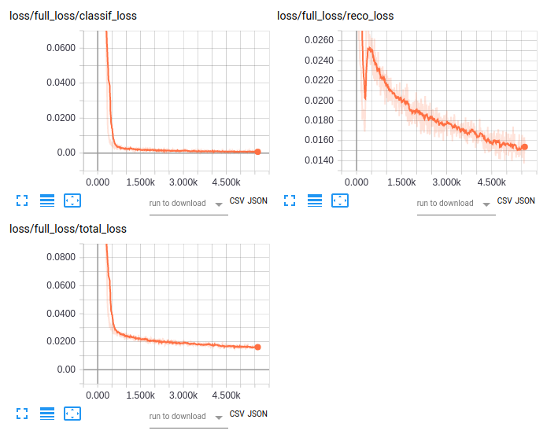
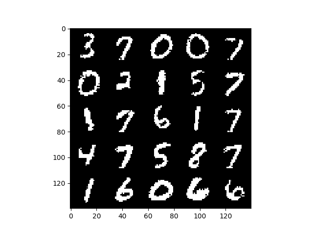

# Capsule-Net-TF

A tiny implementation of the recently published Capsule Network by G.Hinton and colleague ( [paper link](https://arxiv.org/pdf/1710.09829.pdf) )

 * A novel concept of 'Capsules' which is basically vector-neurons as opposed to scalar neurons (the familier ones)
 * A routing algorithm (refer paper)
 * a not-so-deep network of capsules and normal convolutions
 * state-of-the-art performance on MNIST

## My implementation is still running on a 1050-TI GPU and hopefully is correct. I will add the results as soon as I can

> Validation Accuracies

| Epoch-1 | Epoch-2 | Epoch-3 | Epoch-4 | Epcoh-5 | Epoch-6 | Epoch-7 | Epoch-8 |
| ------- | ------- | ------- | ------- | ------- | ------- | ------- | ------- |
|  96.2%  |  98.27  |  98.82  |  98.89  |  99.01  |  99.07  |  99.15  |  99.27  |
> Okay I am not running anymore before updating the code

A screenshot from tensorboard

Reconstructions:
(I produced the reconstruction images from the end of the regularizing decoder and this is how they look like)

###### Although, my goal is not to achieve highest test-accuracy but to understand the dynamics of the network and the capsules

> There is an amazing implementation (github.com/naturomics/CapsNet-Tensorflow)[https://github.com/naturomics/CapsNet-Tensorflow]. Go check it out. It helped me a little
